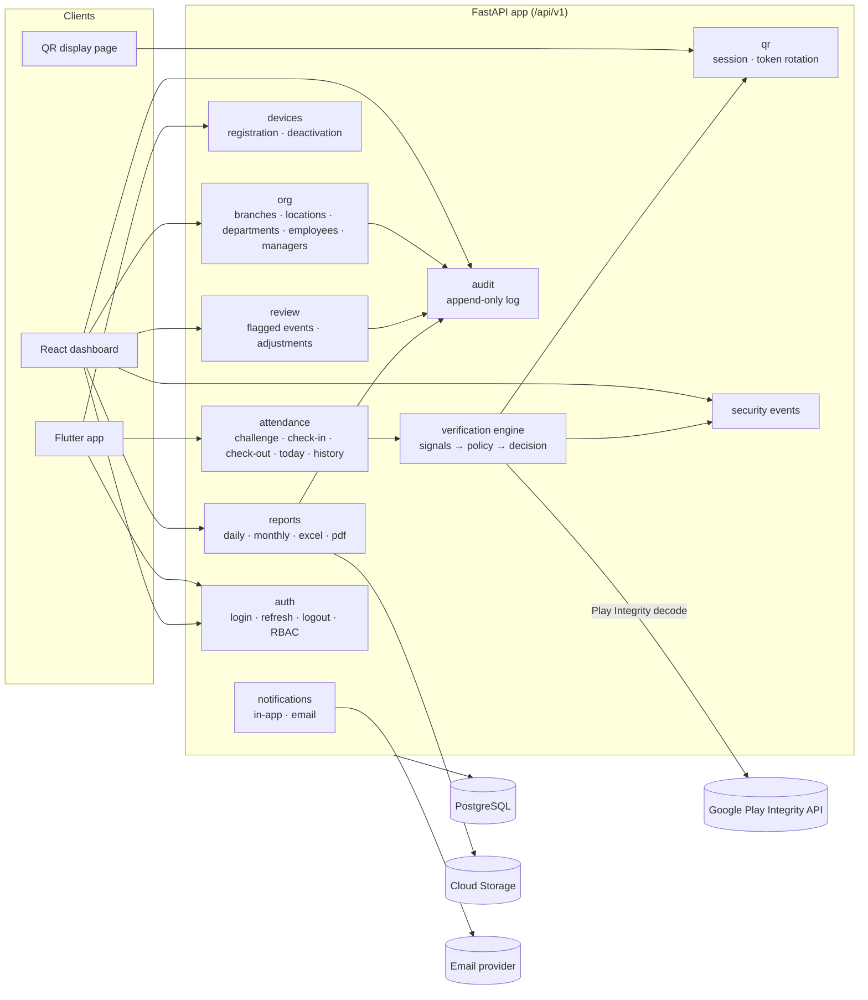
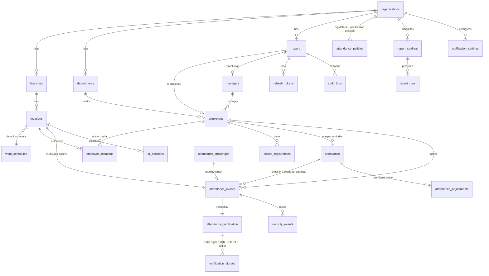
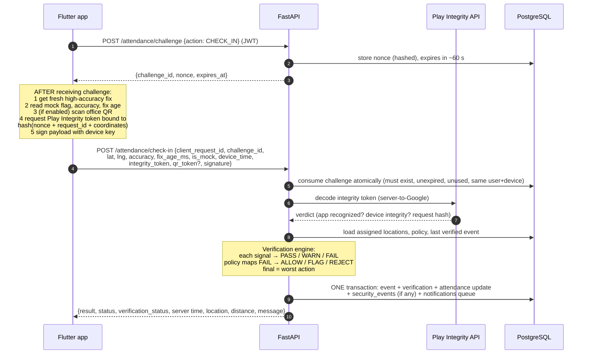

# Phase 1 — Architecture & System Design

Employee Attendance & Location Management System
Status: **Decisions recorded in section 12 + 12.1 (latest wins) — overrides earlier sections where they differ**

---

## 0. Guiding principles (how every later phase is judged)

1. **The phone provides evidence; the server decides.** The app never sends "inside = true", never sends a status, never sends a trusted time.
2. **No single signal is trusted.** GPS, mock-location flags, Play Integrity, QR, and movement history are each just one input. Each can be fooled on its own; the goal is to make faking attendance *expensive and visible*, not "impossible" (nothing on Android is impossible to fake).
3. **Every decision is explainable.** Each attempt stores every signal, the policy that was in force, and the result, so HR can see *why* something was accepted, flagged, or rejected.
4. **Configurable, not hard-coded.** Working hours, grace periods, radii, thresholds, and what each failed check does (ALLOW / FLAG / REJECT) live in the database.
5. **Privacy by default.** Location is captured **only** at the moment of check-in/check-out. No background tracking.
6. **Append-only history.** Attendance events and audit logs are never edited in place; corrections are new records that reference the old ones.

---

## 1. Overall architecture

```
 ┌───────────────────────┐        ┌──────────────────────────┐       ┌──────────────────────┐
 │ Flutter Android app   │        │ React/TS web dashboard   │       │ Office QR display    │
 │ (employees)           │        │ (managers, HR, admins)   │       │ (browser on a screen │
 │  - login              │        │  - dashboards, filters   │       │  /tablet in office)  │
 │  - check-in/out       │        │  - CRUD, settings        │       │  - rotating QR       │
 │  - history            │        │  - reports, audit        │       │    (optional)        │
 └─────────┬─────────────┘        └────────────┬─────────────┘       └──────────┬───────────┘
           │ HTTPS (JSON, JWT)                 │ HTTPS (same domain)            │ HTTPS
           ▼                                   ▼                                ▼
 ┌──────────────────────────────────────────────────────────────────────────────────────────┐
 │ Google Cloud HTTPS Load Balancer  +  Cloud Armor (WAF, rate limiting, TLS certificates)    │
 │   attendance.example.com/        → dashboard (static files)                               │
 │   attendance.example.com/api/v1  → FastAPI backend                                        │
 └───────────────────────────────┬──────────────────────────────────────────────────────────┘
                                 ▼
 ┌──────────────────────────────────────────────────────────────────────────────────────────┐
 │ Cloud Run service: attendance-api  (FastAPI, Python 3.12, stateless containers)            │
 │  auth · org/location mgmt · attendance · verification engine · reports · audit             │
 └──────┬───────────────┬──────────────────┬──────────────────────┬─────────────────────────┘
        │               │                  │                      │
        ▼               ▼                  ▼                      ▼
 ┌────────────┐  ┌──────────────┐  ┌────────────────┐  ┌──────────────────────────┐
 │ Cloud SQL  │  │ Cloud Storage│  │ Secret Manager │  │ Google Play Integrity API │
 │ PostgreSQL │  │ (report files│  │ (DB password,  │  │ (server-side decoding of  │
 │ (private   │  │  signed URLs)│  │  JWT keys, QR  │  │  integrity tokens)        │
 │  IP)       │  └──────────────┘  │  key, SMTP)    │  └──────────────────────────┘
 └─────▲──────┘                    └────────────────┘
       │
 ┌─────┴──────────────────────────────────────────┐      ┌──────────────────────────┐
 │ Cloud Run Jobs (same container image)           │◄─────│ Cloud Scheduler (cron)   │
 │  - end-of-day close (ABSENT, MISSING_CHECKOUT)  │      └──────────────────────────┘
 │  - scheduled reports + email                    │──────► SMTP / email provider
 │  - data-retention purge                         │
 └─────────────────────────────────────────────────┘
 Cloud Logging · Cloud Monitoring (alerts, uptime) · Error Reporting — for all of the above
```

### Why this shape

| Choice | Reason |
|---|---|
| One backend service (modular monolith), not microservices | Thousands of employees ≈ a few thousand requests in a morning peak. One well-structured FastAPI app handles that easily and is far simpler to build, test, deploy and debug. Modules are kept separate inside the code so they can be split later if ever needed. |
| Dashboard and API on the **same domain** (path routing) | No CORS problems for the dashboard, refresh-token cookie can be `SameSite=Strict`. |
| Background work as **Cloud Run Jobs** using the same image | Reports and end-of-day processing don't slow down check-ins; no separate codebase. |
| PostgreSQL as the single source of truth (no Redis at first) | Nonces, rate-limit counters for login, and job state fit in Postgres at this scale. Saves ~$50+/month and one moving part. Redis (Memorystore) can be added later if needed. |

---

## 2. Component diagram (backend internals)



Each module = `router` (HTTP) → `service` (business rules) → `models` (database). Routers contain no business logic; that makes the verification engine and attendance rules unit-testable without HTTP or a database.

---

## 3. Database entity-relationship design

### 3.1 Entities and relationships



### 3.2 Tables (key columns only — full DDL comes in Phase 2)

All tables: `id UUID PK` (generated), `created_at`, `updated_at` (except append-only tables, which have only `created_at`). All timestamps stored as `TIMESTAMPTZ` in UTC; display converted to the location's timezone.

**Organization structure**

| Table | Key columns |
|---|---|
| `organizations` | name, default_timezone, settings (jsonb: company name on reports, logo) |
| `branches` | organization_id, name, code, is_active |
| `locations` | branch_id, name, address, latitude, longitude, radius_m, timezone (e.g. `Africa/Lagos`), work_schedule_id, is_active |
| `work_schedules` | name, start_time, end_time, grace_minutes, early_departure_minutes, working_days (e.g. Mon–Fri), timezone |
| `departments` | organization_id, name, code, is_active |
| `users` | email (unique), password_hash, role (`EMPLOYEE`/`MANAGER`/`HR`/`ADMIN`), is_active, failed_login_count, locked_until, password_changed_at, last_login_at |
| `employees` | user_id (unique), employee_code (unique, e.g. `EMP-00123`), full_name, phone, department_id, manager_id, work_schedule_id (optional override), employment_status |
| `managers` | user_id (unique), employee_id (nullable — a manager may also be an employee who checks in) |
| `employee_locations` | employee_id, location_id, is_primary, valid_from, valid_to — unique (employee_id, location_id) |

**Auth & devices**

| Table | Key columns |
|---|---|
| `refresh_tokens` | user_id, token_hash (never the raw token), family_id (rotation chain), device_registration_id, expires_at, revoked_at, replaced_by_id |
| `device_registrations` | employee_id, install_id (app-generated UUID), device_model, os_version, app_version, public_key (optional, see §4.5), last_integrity_verdict, status (`ACTIVE`/`DEACTIVATED`/`REREGISTRATION_REQUIRED`), last_seen_at |

**Attendance (the auditable core — §16 of your spec)**

| Table | Key columns |
|---|---|
| `attendance_challenges` | employee_id, device_registration_id, nonce_hash, action (`CHECK_IN`/`CHECK_OUT`), issued_at, expires_at, consumed_at — single use |
| `attendance` | employee_id, attendance_date (local date at the location), location_id, schedule snapshot (start/end/grace copied at check-in so later schedule edits don't rewrite history), check_in_event_id, check_out_event_id, check_in_at, check_out_at, worked_minutes, arrival_status, departure_status, day_status, verification_status — **unique (employee_id, attendance_date)** |
| `attendance_events` | attendance_id (nullable for rejected attempts), employee_id, event_type, client_request_id, challenge_id, **server_received_at (authoritative time)**, device_reported_time, latitude, longitude, accuracy_m, fix_age_ms, location_id (nearest authorized), distance_m, device_registration_id, app_version, is_offline_submission, result (`ACCEPTED`/`FLAGGED`/`REJECTED`), employee_message_code, review_status, reviewed_by, reviewed_at, review_note — **unique (employee_id, client_request_id)** |
| `attendance_verification` | event_id (unique), geofence, gps_accuracy, mock_location, play_integrity, location_age, timestamp_check, replay_check, movement_check, qr_check, device_check (each `PASS`/`WARN`/`FAIL`/`NOT_APPLICABLE`), raw details (jsonb: integrity verdict fields, implied speed, etc.), risk_score (internal only), policy_snapshot (jsonb), final_result |
| `verification_signals` | verification_id, signal_type (`QR`, future `NFC`, `BLE_BEACON`, `SELFIE`), result, details jsonb — lets new methods be added **without schema changes** to the tables above |
| `attendance_adjustments` | attendance_id, changed_by, field, old_value, new_value, reason — HR corrections never overwrite silently |

**Security, QR, policy, audit, reports**

| Table | Key columns |
|---|---|
| `attendance_policies` | organization_id, location_id (null = org default), verification_mode (`GPS_ONLY`/`GPS_QR`/`GPS_QR_PLUS`), on_mock_location, on_integrity_fail, on_poor_accuracy, on_outside_geofence, on_impossible_travel (each `ALLOW`/`FLAG`/`REJECT`), max_accuracy_m, max_fix_age_s, challenge_ttl_s, max_travel_speed_kmh, offline_allowed |
| `qr_sessions` | location_id, display_label, key_version, rotation_seconds, is_active, created_by, last_heartbeat_at |
| `security_events` | organization_id, employee_id, user_id, attendance_event_id, type (`MOCK_LOCATION`, `INTEGRITY_FAIL`, `REPLAY`, `IMPOSSIBLE_TRAVEL`, `LOGIN_FAILED`, `REFRESH_TOKEN_REUSE`, `QR_INVALID`, …), severity, details jsonb, ip_address — append-only |
| `audit_logs` | actor_user_id, actor_role, action, object_type, object_id, old_value jsonb, new_value jsonb, ip_address, user_agent, created_at — **append-only, enforced in the database** |
| `report_settings` | organization_id, report_type, schedule (cron + timezone), recipients (roles/users), format, is_enabled |
| `report_runs` | report_setting_id (nullable for manual exports), requested_by, parameters jsonb, status, gcs_object_path, row_count, completed_at |
| `notification_settings` | organization_id, event_type, channel (`IN_APP`/`EMAIL`), recipients rule, is_enabled, thresholds jsonb |
| `notifications` | user_id, type, title, body, read_at |
| `retention_settings` | data_category, retain_days |

### 3.3 Status model (how your 10 statuses map)

Your list mixes three different questions. Storing them separately avoids contradictions (e.g. "LATE" *and* "SUSPICIOUS" can both be true):

| Field | Values | Set by |
|---|---|---|
| `arrival_status` | `PRESENT`, `LATE` | check-in, compared against schedule in location timezone |
| `departure_status` | `CHECKED_OUT`, `EARLY_DEPARTURE`, `MISSING_CHECKOUT` | check-out, or end-of-day job |
| `day_status` | `PRESENT`, `LATE`, `ABSENT`, `PENDING_REVIEW` | derived; `ABSENT` set by end-of-day job when no accepted check-in |
| `verification_status` | `VERIFIED`, `SUSPICIOUS`, `PENDING_REVIEW`, `REJECTED` | verification engine; HR review |
| event `result` + reason | `ACCEPTED` / `FLAGGED` / `REJECTED`; reasons such as `OUTSIDE_LOCATION` | verification engine |

The dashboard shows a single combined badge (e.g. "LATE · Pending review") built from these fields.

### 3.4 Indexes and scale

Indexes on: `employees(department_id)`, `employees(manager_id)`, `employee_locations(location_id)`, `attendance(attendance_date)`, `attendance(employee_id, attendance_date)` (unique), `attendance(location_id, attendance_date)`, `attendance(verification_status)` (partial index on non-VERIFIED), `attendance_events(employee_id, server_received_at DESC)` (used by impossible-travel check), `attendance_events(location_id, server_received_at)`, `security_events(created_at)`, `audit_logs(created_at)`, `audit_logs(object_type, object_id)`.

Volume estimate: 3,000 employees × ~2.2 events/day × 260 days ≈ **1.7 M event rows per year**. PostgreSQL handles this without partitioning. Monthly partitioning of `attendance_events`/`audit_logs` can be added later if growth demands it; the design doesn't block it.

---

## 4. Security architecture

### 4.1 Authentication

| Item | Design |
|---|---|
| Password hashing | **Argon2id** (via `pwdlib`/`argon2-cffi`). Minimum length + breached-password-style checks configurable. |
| Access token | JWT, **15 minutes**, signed with a key from Secret Manager, includes `sub`, `role`, `org`, `jti`, `kid` (key id → keys can be rotated). |
| Refresh token | Opaque random 256-bit value, stored **hashed**. **Rotated on every use**; reusing an old one revokes the whole family and logs `REFRESH_TOKEN_REUSE` (detects stolen tokens). Mobile: 30 days, bound to the device registration. Dashboard: 12 hours in an `HttpOnly; Secure; SameSite=Strict` cookie. |
| Mobile token storage | `flutter_secure_storage` (Android Keystore-backed). |
| Dashboard token storage | Access token in memory only; refresh in the HttpOnly cookie (JavaScript can't read it). |
| Lockout | Failed logins counted per user + per IP in Postgres; temporary lockout with backoff; every failure → `security_events`. |
| Logout | Revokes the refresh-token family. |

### 4.2 Authorization (RBAC + data scoping)

Role alone is not enough — a manager must only see **their** employees. Every query passes through a scope filter:

| Role | Scope |
|---|---|
| EMPLOYEE | own profile, own attendance; cannot create/modify attendance except via check-in/out endpoints |
| MANAGER | employees where `employees.manager_id = me` (read, export); can comment/escalate flagged events (decision 11.6) ; cannot touch security logs or policies |
| HR | whole organization: employees, locations, attendance review & adjustments, reports, security events (read) |
| ADMIN | everything, including policies, users, QR, email settings |

Enforced in the service layer (one `scope_for(user)` function used everywhere) and covered by "unauthorized manager/HR access" tests.

### 4.3 Transport & platform

- HTTPS only (Google-managed certificate on the load balancer); HSTS.
- Cloud Armor: per-IP rate limits (e.g. login, check-in), OWASP rule set, optional geo restriction.
- CORS: none needed for the dashboard (same domain). Explicit allow-list only if something else needs it.
- SQL injection: SQLAlchemy parameterised queries only; no string-built SQL.
- Input validation: Pydantic v2 schemas with ranges (latitude −90..90, accuracy ≥ 0, string lengths, enums).
- Secrets: **only** in Secret Manager, injected into Cloud Run at runtime. Nothing secret in Flutter or React code — the app only contains the public API URL.
- Database: private IP only, encrypted at rest (Google default), TLS in transit, automated backups + point-in-time recovery. Application connects with a role that **cannot UPDATE or DELETE** `audit_logs`, `security_events`, `attendance_events`.
- Service accounts: Cloud Run runs as a dedicated service account with only the roles it needs (Cloud SQL client, Secret accessor, Storage object admin on the reports bucket, Play Integrity access). No JSON key files.

### 4.4 Audit trail

- Written by the same database transaction as the change it describes (so a change can't happen without its log row).
- Captures actor, role, action, object, old → new values, IP, user agent.
- Append-only enforced by DB permissions + a trigger that rejects UPDATE/DELETE. Optional hash-chaining (each row stores hash of previous) to make tampering detectable even by a DB admin — recommended, cheap.
- Viewing audit logs is itself not audited (avoids noise); exporting them is.

### 4.5 Device binding (recommended)

Device IDs can be reset, so they are a *label*, not a security control. The stronger option:

1. At first login on a phone, the app creates a **key pair inside the Android Keystore** (private key never leaves the hardware).
2. The public key is registered in `device_registrations`.
3. Every check-in/out request is **signed** with that key.
4. The server verifies the signature → a stolen access token can't be used from another device or a script.

HR/Admin can deactivate a device or force re-registration. Whether to allow one or several devices per employee is decision 11.8.

---

## 5. Attendance verification flow



### 5.1 Server checks, in order

| # | Check | Hard rule or policy? |
|---|---|---|
| 1 | JWT valid, user active, employee active, device registration active, signature valid | Hard reject (401/403) |
| 2 | Challenge exists, belongs to this user + device + action, not expired, not consumed → consumed now | Hard reject (`REPLAY`) |
| 3 | `client_request_id` already used → return the **original** result (safe retry after network glitch), never a second record | Idempotent |
| 4 | Action allowed in current state (no check-out without check-in, no second check-in same day — subject to decision 11.4) | Hard reject |
| 5 | Input sanity (coordinate ranges, accuracy > 0, not exactly 0.0/0.0, not suspiciously "perfect" precision) | WARN signal |
| 6 | **Geofence** — Haversine distance to each *authorized* location; pick nearest; compare with its radius | Policy (`on_outside_geofence`) |
| 7 | **GPS accuracy** ≤ `max_accuracy_m` | Policy |
| 8 | **Location age** — fix age ≤ `max_fix_age_s` and fix obtained after the challenge was issued | Policy |
| 9 | **Mock location** flag | Policy |
| 10 | **Play Integrity** verdict (decoded server-side; request hash must match) | Policy |
| 11 | **Device clock** vs server clock difference (large skew = signal only; the server time is always what's stored) | WARN signal |
| 12 | **Impossible movement** vs last verified event | Policy (default FLAG) |
| 13 | **QR** token (if mode requires it) | Hard reject if required and missing/invalid |
| 14 | Arrival/departure status from schedule using **server time** in the location's timezone | Rule |

**Geofence detail (accuracy-aware):**
- `distance ≤ radius` → PASS
- `distance > radius` but `distance − accuracy ≤ radius` → WARN (the person *might* be inside; poor signal)
- `distance − accuracy > radius` → FAIL (`OUTSIDE_LOCATION`)

### 5.2 Decision

```
final = REJECT   if any hard rule fails or any FAIL maps to REJECT
final = FLAG     else if any FAIL maps to FLAG, or ≥ N WARN signals, or conflicting signals
final = ACCEPT   otherwise
```

- `ACCEPT` → attendance updated, `verification_status = VERIFIED`.
- `FLAG` → attendance updated **provisionally** with `PENDING_REVIEW`, HR notified (whether flagged check-ins count as present before review is decision 11.6).
- `REJECT` → event stored for audit, attendance **not** changed, employee may retry with a new challenge.

A risk score (0–100) is computed and stored for sorting the review queue, but **the decision comes from the rules above, not the score**.

### 5.3 What the employee sees

Messages are helpful but never reveal *which* security check fired:

| Internal reason | Message to employee |
|---|---|
| Outside geofence | "You appear to be outside your assigned work location." |
| Poor accuracy / stale fix | "Your location signal is weak. Move to an open area or near a window and try again." |
| Mock location, integrity failure, impossible travel, bad signature | "We couldn't verify this check-in. It has been sent to HR for review." (FLAG) or "…Please contact HR." (REJECT) |
| QR invalid/expired | "The QR code has expired. Scan the code currently on the office screen." |

---

## 6. Anti-GPS-spoofing strategy (layered, honest)

| Layer | What it catches | What it does NOT catch |
|---|---|---|
| **Server-side geofence** | App sending made-up "inside" claims; client-side logic tampering | Coordinates that are themselves faked |
| **Mock-location flag** (`Location.isMock()` on Android 12+, `isFromMockProvider()` on older) | Common "Fake GPS" apps that use Android's mock-location developer feature | Rooted devices, Xposed/Magisk modules, modified apps, hardware GPS spoofers — they can hide the flag |
| **Play Integrity** (verdicts decoded on our server, never trusted from the app) | Modified/re-signed versions of our app, apps not installed from Play, emulators, many rooted/compromised devices (`MEETS_DEVICE_INTEGRITY` / `MEETS_STRONG_INTEGRITY`) | Well-hidden root setups on some devices; does not inspect location itself |
| **Nonce/challenge + request-hash binding** | Replaying an old valid request; reusing an integrity token for a different request | — |
| **Device key signature** | Scripts calling the API with a stolen token; requests from another phone | A user operating their own registered phone |
| **Accuracy & fix-age checks** | Old cached fixes; very poor fixes that "happen" to fall in radius | Spoofers that report good accuracy |
| **Impossible movement** | Teleporting between locations (Lagos 09:00 → Abuja 09:15 ≈ 2,000 km/h implied) | A spoofer that consistently fakes the same spot |
| **Rotating QR in the office** (optional) | Being somewhere else entirely with a fake GPS — this is the strongest *physical-presence* signal | A colleague in the office relaying a live photo of the QR (mitigated by 30-s rotation, GPS still required, and flags when one QR window is used from very different coordinates) |
| **Statistics for HR** | Patterns: same person flagged repeatedly, identical coordinates every day, accuracy always exactly the same | — |

**Conclusion to communicate to management:** GPS-only mode stops casual cheating and makes the rest visible. If a location needs high assurance, enable **GPS + QR**. Nothing in this list makes spoofing impossible; together they make it costly and leave a trail.

### 6.1 Rotating QR design

- Each office has a QR display (a screen/tablet showing a dashboard page logged in with a **display-only credential** bound to one location).
- Token = `HMAC-SHA256(location_secret, location_id ‖ time_window)` truncated, with `time_window = floor(now / 30 s)`. The display page fetches the current token from the server (the secret never leaves the server), so an employee **cannot generate** valid tokens.
- Server accepts current window ± 1 (clock tolerance), checks the token's location equals the geofence location, and records it in `verification_signals`.
- The same table/API pattern later accepts `NFC` (signed tag challenge), `BLE_BEACON` (rotating beacon ID), `SELFIE` (photo stored in Cloud Storage + review) without changing existing tables.

### 6.2 Time & staleness

- **Authoritative time = server receive time.** Device time is stored only as evidence.
- The challenge expires ~60 s after issue, so the whole capture → submit cycle must happen within a server-measured window — an old reading can't be saved and submitted later.
- Fix age is measured on the phone's **monotonic clock** (time since boot, which the user can't change in Settings), so changing the phone's clock doesn't help.

---

## 7. Offline / poor connectivity (recommended approach)

**Recommendation for v1: online-only check-in**, with good retry behaviour:
- Requests are idempotent (`client_request_id`), so if the network drops after sending, the app retries and gets the *same* result — no duplicates.
- Short timeouts, clear "No connection — try again" message, automatic retry when connectivity returns *while the challenge is still valid*.

**Optional offline mode (off by default, per-location policy):**
1. While online, the app holds **one** pre-issued offline token per action per day (single-use, signed by server, bound to device, expires in ~12 h).
2. Offline evidence is encrypted with a Keystore key and stored; only one pending event per action per day.
3. On reconnect, server validates the token, signature, monotonic-clock elapsed time (detects reboots), and Play Integrity.
4. Result is **always** `PENDING_REVIEW` with `is_offline_submission = true` — never fully verified automatically. Time recorded = device evidence, clearly labelled as unverified.

---

## 8. Google Cloud architecture

### 8.1 Cloud Run vs Compute Engine

| | **Cloud Run** (recommended) | Compute Engine (VM) |
|---|---|---|
| What you manage | Just a container image | OS, patches, Python, nginx, TLS renewal, process manager, disk |
| Scaling | Automatic; handles the 08:00 check-in spike | Manual; must size for the peak, pay for it all day |
| HTTPS | Built-in / via load balancer with Google-managed certs | Certbot/nginx you maintain |
| Deployments & rollback | One command; instant rollback to previous revision | Scripts, SSH, downtime risk |
| Background jobs | Cloud Run Jobs + Cloud Scheduler | cron on the VM (dies with the VM) |
| Security posture | No SSH surface, no OS to patch | You're responsible for hardening |
| Cost at this scale | ~$20–60/mo (with 1 warm instance) | ~$25–50/mo for a small VM, but more of your time |
| When a VM wins | — | Long-running processes, special OS libraries, websockets with heavy state |

You've run a project on a VM before (it works), but this system has no needs a VM uniquely solves, and Cloud Run removes most of the operations work. **Decision: Cloud Run**, with `min-instances=1` so the first check-in of the morning isn't slow.

### 8.2 Services

| Need | Service | Notes |
|---|---|---|
| API | Cloud Run `attendance-api` | min 1 / max ~10 instances, 1 vCPU, 512 MB–1 GB |
| Dashboard | Cloud Run `attendance-dashboard` (nginx serving the static build) | Same LB, path routing |
| HTTPS + WAF | External Application Load Balancer + Cloud Armor + managed certificate | ~$18/mo base |
| Database | **Cloud SQL for PostgreSQL 16**, private IP | Start 2 vCPU / 8 GB; automated daily backups (keep 14–30), point-in-time recovery 7 days; HA (regional) optional — decision 11.11 |
| Files | Cloud Storage bucket (private) | Reports downloaded via short-lived signed URLs; lifecycle rule deletes after N days |
| Secrets | Secret Manager | DB password, JWT signing keys, QR master key, SMTP credentials |
| Scheduling | Cloud Scheduler → Cloud Run Jobs | end-of-day close per timezone, daily/weekly/monthly reports, retention purge |
| Images | Artifact Registry | |
| CI/CD | Cloud Build (or GitHub Actions with Workload Identity Federation) | build → test → push → migrate → deploy |
| Migrations | Alembic, run as a Cloud Run Job before each deploy | |
| Observability | Cloud Logging (structured JSON logs), Monitoring dashboards + alerts (error rate, latency, DB CPU, failed jobs), Error Reporting, uptime check | |

**Rough monthly cost (single-zone DB):** ~$150–250. With HA database: ~$250–400. (Estimates — exact pricing depends on region and usage.)

### 8.3 Environments

`dev` (your PC, Docker Postgres) → `staging` (small GCP project or same project, separate DB) → `prod`. Separate GCP projects for staging and prod are recommended so a mistake in staging can't touch production data.

---

## 9. Project folder structure

New folder: `D:\claude\attendance-system\` (the existing `D:\claude\attendance` Expo/Firebase app is a different design — background tracking, no server verification — and is left untouched).

```
attendance-system/
├── backend/
│   ├── app/
│   │   ├── main.py                 # FastAPI app factory
│   │   ├── core/                   # config, security (hashing, JWT), logging, errors
│   │   ├── db/                     # engine/session, base model
│   │   ├── models/                 # SQLAlchemy tables
│   │   ├── schemas/                # Pydantic request/response models
│   │   ├── api/v1/                 # routers: auth, employees, locations, attendance, manager, hr, reports, security, admin, qr
│   │   ├── services/               # business logic
│   │   │   ├── verification/       # geofence.py, signals/*.py, policy.py, engine.py
│   │   │   ├── attendance_rules.py # PRESENT/LATE/EARLY... from schedule
│   │   │   ├── integrity.py        # Play Integrity decoding
│   │   │   ├── reports/            # queries, excel.py, pdf.py
│   │   │   └── notifications/      # email, in-app
│   │   ├── jobs/                   # entry points for Cloud Run Jobs
│   │   └── permissions.py          # RBAC + data scoping
│   ├── alembic/                    # database migrations (the real source of the schema)
│   ├── tests/  unit/ api/ conftest.py
│   ├── requirements.txt  requirements-dev.txt
│   ├── Dockerfile
│   └── .env.example
├── mobile/                         # Flutter
│   ├── lib/
│   │   ├── main.dart
│   │   ├── core/                   # api client, secure storage, config, theme
│   │   ├── features/  auth/ attendance/ history/ profile/
│   │   └── platform/               # Dart side of Kotlin channels (integrity, device key, monotonic clock)
│   ├── android/app/src/main/kotlin/…   # Play Integrity + Keystore signing + mock flag
│   ├── test/
│   └── pubspec.yaml
├── dashboard/                      # React + TypeScript (Vite)
│   ├── src/
│   │   ├── api/                    # typed API client
│   │   ├── auth/                   # session, role guards
│   │   ├── components/             # layout, tables, filters, charts
│   │   ├── features/  dashboard/ employees/ departments/ locations/ attendance/ suspicious/ reports/ settings/ audit/ qr-display/
│   │   └── routes.tsx
│   ├── public/
│   └── package.json
├── database/
│   ├── seeds/                      # demo org, locations (Lagos, Abuja, …), test users
│   └── erd/                        # generated diagrams
├── infrastructure/
│   ├── docker/docker-compose.yml   # local PostgreSQL (+ pgAdmin)
│   └── cloud/                      # gcloud setup/deploy scripts, Cloud Armor rules, scheduler jobs
├── docs/                           # this file + one doc per phase
└── .github/workflows/              # CI (tests on every push)
```

Adjustment from your example: migrations live in `backend/alembic/` (generated from the Python models, so code and schema can't drift); `database/` keeps seeds and diagrams.

**Main libraries**

| Part | Libraries |
|---|---|
| Backend | FastAPI, Uvicorn, SQLAlchemy 2 (sync sessions, psycopg 3 — see docs/03), Alembic, Pydantic v2 + pydantic-settings, PyJWT, pwdlib[argon2], google-auth / Play Integrity client, openpyxl (Excel), ReportLab (PDF — works on Windows without extra system libraries), pytest + httpx |
| Mobile | geolocator (position, accuracy, `isMocked`), dio, flutter_riverpod, go_router, flutter_secure_storage, mobile_scanner (QR), uuid; small Kotlin code for Play Integrity Standard API + Keystore signing |
| Dashboard | Vite, React 18, TypeScript, React Router, TanStack Query, MUI (+ MUI X DataGrid), Recharts, react-hook-form + zod |

---

## 10. Development roadmap

Each phase ends with something you can run and test; I wait for your confirmation before the next one.

| # | Phase | Deliverable you can test |
|---|---|---|
| 1 | Architecture | This document; your answers to section 11 |
| 2 | Database | Postgres in Docker; Alembic migration creates all tables; seed script loads demo org (Lagos, Abuja, …) |
| 3 | Backend skeleton | `GET /api/v1/health` returns OK incl. DB check; Swagger at `/docs`; first pytest run |
| 4 | Auth & roles | Login/refresh/logout; role guards; lockout; tests for invalid/expired JWT, token reuse |
| 5 | Org/location/employee APIs | CRUD for branches, locations, departments, employees, managers, assignments; audit logging begins |
| 6 | Attendance data + APIs | challenge, check-in/out endpoints (GPS signals stubbed), today/history, schedule rules (PRESENT/LATE/...) |
| 7 | Geofence | Haversine + accuracy-aware geofence; tests: inside, outside, edge, wrong location |
| 8 | Anti-spoofing | Policy engine, mock/accuracy/age/replay/movement checks, Play Integrity decoding, device signature, QR tokens, security events |
| 9 | Flutter app foundation | Login, secure storage, home screen with profile/status (needs Android Studio + phone/emulator) |
| 10 | Check-in/out in app | Real GPS, challenge flow, integrity token, QR scan, result screens, history |
| 11 | Manager dashboard | React app: login, team table, filters, KPIs, export button |
| 12 | HR/Admin dashboard | Org-wide views, charts, CRUD screens, policy settings, review queue, devices |
| 13 | Reports | Daily/weekly/monthly + per-location/department/manager/late/absence/suspicious queries; end-of-day job |
| 14 | Excel/PDF | Formatted .xlsx (filters, frozen panes, totals, summary) and PDF reports |
| 15 | Email automation | Scheduled jobs, per-manager team reports, notifications |
| 16 | Audit & monitoring | Audit log viewer, security-event dashboard, append-only enforcement, alerting rules |
| 17 | Testing hardening | Fill coverage gaps, end-to-end scenarios, load test of the 08:00 spike |
| 18 | GCP deployment | Projects, Cloud SQL, Cloud Run, LB + certs + Cloud Armor, secrets, scheduler, backups, monitoring — exact commands |
| 19 | Android release | Signing key, AAB/APK, Play Console upload, Play Integrity production config |
| 20 | Security review | Threat-model walkthrough, dependency scan, config review, pen-test checklist |

Notes:
- Tests are written **in every phase**; Phase 17 adds end-to-end and load tests.
- **Start the Google Play Console account early** (during Phase 5–6): organisation accounts need a D-U-N-S number and verification can take days to weeks, and Play Integrity needs the app registered there.
- Local tools needed for Phase 2–8: Python 3.12, Docker Desktop (needs WSL2 — admin rights on Windows 10 Enterprise may be required), Git, VS Code. Flutter + Android Studio are only needed from Phase 9; Node.js from Phase 11.

---

## 11. Decisions needed from you before Phase 2

**Blocking — these change the database design:**

| # | Question | My recommendation |
|---|---|---|
| 11.1 | How will the app be installed on phones: Google Play (public, private/managed Google Play, or a closed testing track) or a sideloaded APK? Play Integrity only gives meaningful "app recognized" verdicts for apps distributed through Play. | Google Play — private app via managed Google Play, or a closed testing track |
| 11.2 | Which GCP region? Any legal requirement that data stays in Nigeria/Africa (NDPA 2023)? | `africa-south1` (Johannesburg) if residency matters, otherwise `europe-west1` (often lower latency from Nigeria). Confirm with your legal/HR team. |
| 11.3 | Roughly how many employees and locations now, and in 2 years? Company-issued phones or personal phones? | — (sizes the DB and affects privacy notices) |
| 11.4 | Working hours: one schedule per **location**, or can employees have their own schedule/shift? Any shifts crossing midnight? Which days are working days? Exactly one check-in + one check-out per day, or multiple (e.g. lunch out/in)? | Schedule per location with optional per-employee override; one check-in/out pair per day; overnight shifts supported only if you need them |
| 11.5 | Public holidays and leave: should the system know about them (so a person on leave isn't "ABSENT")? Your spec doesn't include leave management. | Add a simple holiday calendar + "excused absence" marking by HR; no full leave-management module |
| 11.6 | Defaults when a check fails (HR can change later): mock location → FLAG or REJECT? integrity fail → FLAG or REJECT? outside geofence → REJECT or FLAG? Does a FLAGGED check-in count as present until HR reviews it? Can managers resolve flagged events, or only HR? | Mock → REJECT, integrity fail → FLAG, outside → REJECT, poor accuracy → FLAG, impossible travel → FLAG; flagged counts provisionally; only HR/Admin resolves, managers can view |
| 11.7 | QR verification in v1? If yes, does each office have a screen/tablet that can display a web page all day? | Build it in Phase 8, enable per location when screens are available |
| 11.8 | Devices: one registered phone per employee, or several? What happens when someone changes phone — HR approves, or automatic with a flag? | One active device; new device is allowed but its first check-ins are FLAGGED until HR approves |
| 11.9 | Offline check-in in v1? | No — online-only with safe retries (section 7); add offline later if real-world need appears |

**Needed later (can answer any time before the phase listed):**

| # | Question | Needed by | Recommendation |
|---|---|---|---|
| 11.10 | Login with employee ID **or** email (or both)? Who creates accounts (HR) and how are first passwords delivered? Self-service "forgot password" by email, or HR resets? | Phase 4 | Both identifiers; HR creates accounts with a one-time temporary password that must be changed at first login; HR/Admin reset |
| 11.11 | Budget: highly-available (two-zone) database (~+$100–150/mo) or single zone with backups? | Phase 18 | Single zone + PITR to start; HA once in full production use |
| 11.12 | Domain name for the system, and email sending: Google Workspace SMTP relay, SendGrid, Mailgun, other? | Phase 15/18 | Whatever your company already uses |
| 11.13 | Retention: how long to keep attendance records, raw GPS coordinates, security events, audit logs? | Phase 16 | Attendance & audit: 7 years (check local labour law); raw coordinates: 12 months then remove coordinates and keep distance/result; security events: 2 years |
| 11.14 | Your PC: can you install Docker Desktop (needs admin rights + WSL2 on Windows 10 Enterprise)? | Phase 2 | If not, we install PostgreSQL natively instead |
| 11.15 | Company name/logo for reports; English only, or other languages in the app? | Phase 9/14 | English only for v1 |

---

## 12. Decisions recorded (2026-10-01)

| # | Decision | Effect on the design |
|---|---|---|
| 11.1 | **Google Play** distribution | Play Integrity Standard API used with full verdicts. Play Console account needed by Phase 9. |
| 11.2 | Region per recommendation | `africa-south1` if legal/HR confirms data must stay in Africa, otherwise `europe-west1`. Final pick needed only at Phase 18. |
| 11.3 | **~500 employees** | Cloud SQL starts at 1–2 vCPU; Cloud Run max ~5 instances. Cost toward lower end of the estimate. |
| 11.4 | **Several check-in/check-out pairs per day**; working hours **09:00–18:00** | New table `attendance_sessions` (attendance_id, check_in_event_id, check_out_event_id, worked_minutes). `attendance` stays one row per employee per day as the daily summary: arrival status from the **first** check-in, departure status from the **last** check-out, worked hours = sum of sessions, MISSING_CHECKOUT if the last session is still open at end of day. Default schedule 09:00–18:00, grace 15 min, Mon–Fri (all configurable). No overnight shifts. |
| 11.5 | **Holidays and leave: yes** | New tables `holidays` (org-wide or per location) and `leave_records` (employee, date range, type, recorded/approved by HR). New day statuses `HOLIDAY`, `ON_LEAVE`, `NON_WORKING_DAY`; these are not ABSENT and are excluded from working days in monthly reports. |
| 11.6 | **Failed checks → FLAG; a flagged event does not count until HR approves** | All policy defaults = `FLAG`. A flagged check-in does **not** mark the employee present; the day shows `PENDING_REVIEW` until HR approves (then counted with the original server time) or rejects. Hard rejects (invalid/replayed challenge, bad token, unapproved device, no assigned location) are unchanged. |
| 11.7 | **QR code changes daily, random, per location** | New table `qr_daily_codes` (location_id, valid_date, code_hash, generated_at). A random code per location is generated at local midnight; HR/location staff display or print it from the dashboard. `qr_sessions.rotation_seconds` stays, so a location can later switch to 30-second rotation on a screen without changing the schema. Extra signal: the same day's code used from coordinates far from the office → FLAG. |
| 11.8 | **New device needs HR approval** | `device_registrations.status` gains `PENDING_APPROVAL`, with `approved_by`, `approved_at`. A new or changed phone cannot check in until HR approves the request; HR gets a notification. |
| 11.9 | **No offline check-in** | Online-only with idempotent retries. Offline design in section 7 not built. |
| 11.14 | Local database | Native PostgreSQL 16 on Windows for development (see the Phase 2 guide); Docker is optional. Container images are built by Cloud Build in Phase 18. |

### 12.1 Updates (2026-10-02)

| # | Decision | Effect on the design |
|---|---|---|
| 11.4 | **Saturday is a working day** | Default working days Mon–Sat, 09:00–18:00 (Saturday hours separately configurable per schedule). |
| 11.7 | **QR changes every 30 seconds** (replaces the daily code above) | Back to the section 6.1 design: HMAC token per 30-s window, generated only by the server. `qr_daily_codes` is **dropped**. Each location needs an always-on screen/tablet with internet running the dashboard's QR display page under a display-only credential. If the display is offline, QR check fails → FLAG (per 11.6). |
| 11.8 | **HR approval per device — purpose: stop one phone being used by several employees** | Each phone gets a device fingerprint = hash of Android's `ANDROID_ID` (stable across app reinstalls for our signing key; changes only on factory reset). Database rule: **one physical device can be actively bound to only one employee** (unique partial index on fingerprint where status in ACTIVE/PENDING_APPROVAL). A second employee logging in on an already-bound phone is blocked, a `DEVICE_SHARED` security event is logged, and HR sees who the phone belongs to. Device-key signatures (section 4.5) stop a token being used from another phone. |
| 11.14 | Local database | PostgreSQL **18.6** already installed (service `postgresql-x64-18`, port 5432). Production Cloud SQL will use the same major version. |
